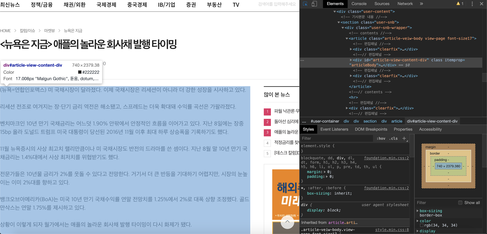

# Scrapy
### Scrapy란?
- 웹사이트를 크롤링하고 구조화된 데이터를 추출하기 위한 애플리케이션 프레임워크
- Scrapy는 원래  web scraping을 위해 설계되었지만 API를 사용하거나 범용 웹 크롤러로 데이터를 추출하는데 사용될 수도 있다. 

### 크롤링 방법
1. Scrapy : 크롤링 속도 조절가능, 웹 크롤링 프레임워크
2. BeautifulSoup :  배우기 쉽다, 빠른개발 가능, urllib,requset 등 다른 패키지 필요
- 두가지 방법 중 본인의 상황에 맞는 것을 사용하면 될 것 같다.

:eyes: 더 자세한 사항은 [Scrapy at a glance](https://docs.scrapy.org/en/latest/intro/overview.html) 참고!


### 특정 키워드가 들어간 뉴스기사만 크롤링하는 코드를 구성하려고 한다.

## Scrapy project 생성
- `conda-forge` 패키지 설치
```
conda install -c conda-forge scrapy
```
- Scarpy 설치
```
pip install Scrapy
```
- Scrapy projecrt 생성
- `newsbot`을 프로젝트명으로 지정
- 아래와 같이 성공적으로 spider가 생성된 것을 확인할 수 있다.
```
> scrapy startproject news

You can start your first spider with:
    cd news
    scrapy genspider example example.com
```

- 프로젝트를 설치한 경로를 따라 들어가면 Scrapy의 구조를 확인할 수 있다.


</img>


- spiders 폴더 아래에 있는 `.py` 파일들은 무엇일까? 

1) `items.py`
-  데이터를 크롤링 할 때 해당 데이터를 클래스(class) 형태로 만든다.
- 뉴스 기사의 경우 기사의 제목(title), 내용(content), 해당기사의 링크(link)의 세 가지 항목을 가져오고 싶을 때, `items.py`에 **scrapy.Field()** 로 정의해주면 된다.

2) `middlewares.py`
- engine에서 다른 모듈로 request와 response 정보가 교환될 때 지나가는 중간 통로

3) `pipelines.py`
- 크롤링해 온 데이터를 처리해줄 때 사용
- 중복체크, 필터링, 데이터베이스 입력 후 처리해주려는 목적

4) `settings.py`
- 프로젝트 모듈간 연결 및 설정을 정의해주는 파일

## Scrapy Selectors
- Scrapy Selectors라고 불리는 XPath 또는 CSS에 기반한 메커니즘을 사용한다.

- XPath와 CSS로 작업하기 위해, Scrapy는 Selector 클래스를 제공하고 response로부터 무엇을 선택할 것인지에 대한 편리한 단축키를 제공한다.

- Xpath 간단한 예시
    - `/html/head/title` : HTML문서의 `<head>`요소를 선택
    - `/html/head/title/text()` : 앞에서 언급한 `<title>`내부의 텍스트를 선택
    - `//td` : 모든 `<td>` 요소 선택
    - `//div[@class='name']` : `class='name'` 속성을 포함한 모든 `div` 요소를 선택
(Scrapy로 크롤링을 하면서 더 자세한 문법을 다룰 예정!)

- Selectors는 4가지 기본 메서드를 가지고 있디.
    - xpath() : 인수로 주어진 XPath에서 선택된 각 노드를 대표하는 selectors 리스트를 돌려준다.
    - css() : 인수로 주어진 CSS에서 각 선택된 각 노드를 대표하는  selectprs 리스트를 돌려준다.
    - extract() : 선택된 데이터와 함께 유니코드 string을 돌려준다.
    - re() : 인수로 주어진 정규표현식을 적용해서 추출한 유니코드 string을 돌려준다.
    
    
## items.py 수정하기
- `items.py` 를 열고 가져올 필드를 미리 선언해준다.
```python
# -*- coding: utf-8 -*-

# Define here the models for your scraped items
#
# See documentation in:
# https://docs.scrapy.org/en/latest/topics/items.html

import scrapy
from scrapy.item import Item, Field


class NewsbotItem(scrapy.Item):
    company = scrapy.Field()
    date = scrapy.Field()
    titles= scrapy.Field()
    content = scrapy.Field()
    film_url = scrapy.Field()
```
- 뉴스 기사를 크롤링 할 것이기 때문에 어느 회사의 기사인지(company), 날짜(date), 기사 제목(titles), 기사 내용(content), 기사의 URL(film_url)을 선언해준다.
    
## Pipelines.py 수정
- 데이터 가공 및 DB저장을 수행하는 파일 (csv, json, MongoDB 등)
- 출력될 데이터를 어떤식으로 출력할지 정의
- 크롤링한 데이터를 `News.csv`로 저장을 한 다음, 바이너리 파일로 쓰기위해 **wb**로 지정해준다.
- `process_item(self, item, spider)` : 리턴된 아이템을 결과로 처리
- `spider_closed(self, spider)` : spider가 종료되면 호출
```python
# -*- coding: utf-8 -*-

# Define your item pipelines here
#
# Don't forget to add your pipeline to the ITEM_PIPELINES setting
# See: https://doc.scrapy.org/en/latest/topics/item-pipeline.html
from __future__ import unicode_literals
from scrapy.exporters import JsonItemExporter, CsvItemExporter


class NewsPipeline(object):
    def __init__(self):
        self.file = open("News.csv", 'wb')
        self.exporter = CsvItemExporter(self.file, encoding='uft-8')
        self.exporter.start_exporting()

    def process_item(self, item, spider):
        self.exporter.export_item(item)
        return item

    def spider_closed(self, spider):
        self.exporter.finish_exporting()
        self.file.close()  # 파일 CLOSE
```

## Settings.py 수정
- 프로젝트에 사용할 모델을 정의해주고 파이프라인을 지정해준다.
- 중요한 것은 `NewsItem`을 지정해 주는 것이다.
```
# -*- coding: utf-8 -*-
.
.
.
BOT_NAME = 'news'

SPIDER_MODULES = ['news.spiders']
NEWSPIDER_MODULE = 'news.spiders'
DEFAULT_ITEM_CLASS = 'news.items.NewsItem'

FEED_FORMAT = "csv"
FEED_URI = "info_news.csv"

# Crawl responsibly by identifying yourself (and your website) on the user-agent
#USER_AGENT = 'news (+http://www.yourdomain.com)'

# Obey robots.txt rules
ROBOTSTXT_OBEY = True
.
.
.
```

- 이렇게 하면 기본적으로 셋팅을 완료한 것!

## spiders/newstart.py 

- 아래와 같이 초기 코드가 구성되어 있다.
- `parse` 에 크롤링할 부분의 코드를 구성해줘야한다.
```python
# -*- coding: utf-8 -*-
import scrapy


class NewstartSpider(scrapy.Spider):
    name = 'newstart'
    allowed_domains = []
    start_urls = []

    def parse(self, response):
        pass
```

- 아래와 같이 크롬에서 개발자 도구를 가면 해당 Elements들을 확인할 수 있다.
- 파싱을 위해 왼쪽 위의 화살표가 그려진 네모박스를 클릭하여 어느 부분을 크롤링할지 확인한다.
</img>


- 기사의 제목을 가져오고 싶은 경우 마우스를 가져다대면 아래와 같이 화면이 말풍선의 띄워진다.
</img>


### 기사의 URL 추출
- xpath로 기사의 주소를 추출하여 urls에 저장한다.
- :eyes: 더 자세한 사항은 [Scrapy at a glance](https://doc.scrapy.org/en/xpath-tutorial/topics/xpath-tutorial.html
) 참고!

- class가 "list-block"인 div의 아래에  class가 "list-titles"인 div의 아래에 @href와 list-titles를 포함하는 @href코드를 추출한다.
``` 
urls = response.xpath('''//div[@class="list-block"]/div[@class="list-titles"]/a[contains(@href,list-titles)]/@href''').extract()
```

- 크롤링을 할 페이지와 추출한 urls을 연결해주기위해 반복문을 사용.
- yield는 generator다 아이템이 생성될때마다 리스트형태(쌓이는 방식 stack형태)로 쌓이게 된다. 
```
for url in urls:
    url = 'http://news.einfomax.co.kr' + url
    
    yield scrapy.Request(url, callback=self.parse_details)
```


- 위에서 진행했던 방식으로 날짜, 기사의 제목, 내용, url을 저장한다.

- 기사의 제목`title`을 추출하는 부분
</img>


- 기사의 내용`content`을 추출하는 부분
</img>


```python
def parse_details(self, response):
    item = NewsItem()
    item['company'] = ['연합인포맥스']
    item['date'] = response.xpath('// *[ @ id = "user-container"] / div[3] / header / section / div / ul / li[2] / text()').extract()
    item['titles'] = response.xpath('//div[@class="article-head-title"]/text()').extract()
    item['content'] = response.xpath('//div[@id="article-view-content-div"]/text()').extract()
    item['film_url'] = response.url
    return item
```

- 위와 같이 코드를 구성해준 후, 터미널에서 `scrapy crawl newstart`로 크롤링을 시작한다.

- 그럼 아래와 같이 `info_news.csv` 파일이 생성된 것을 확인할 수 있다.
</img>


